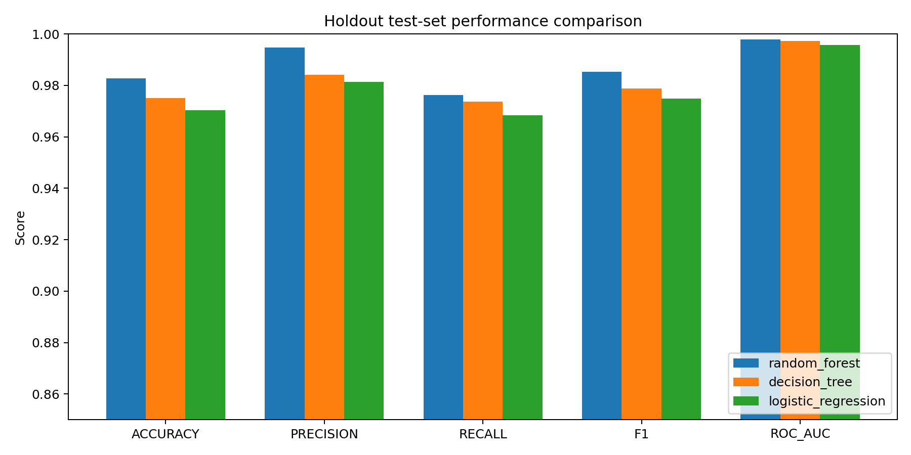
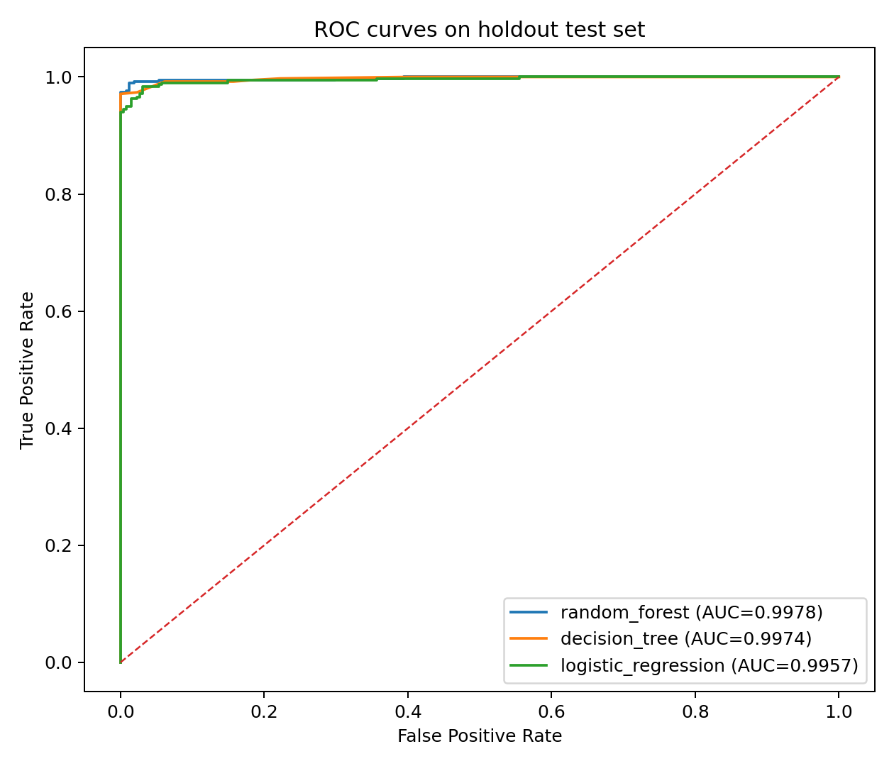
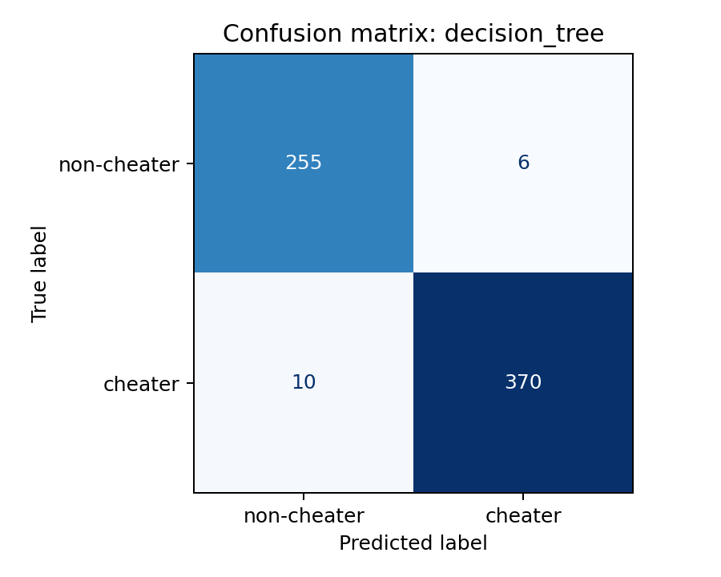
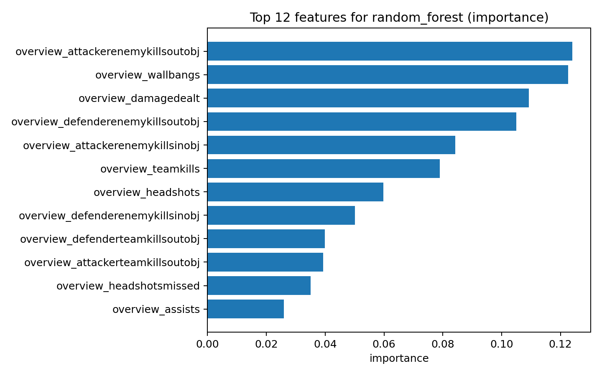

# R6 Cheater Detector

ML project to classify whether a Rainbow Six Siege profile is likely cheating from public stats.

## Why this repo is interesting
- Reproducible **holdout test-set evaluation** (stratified random split, fixed seed).
- Side-by-side benchmark of **3 model variants**:
  - Decision Tree
  - Random Forest
  - Logistic Regression
- Includes a **leakage-safe evaluation pipeline** with train-vs-validation gap reporting.
- Visual artifacts for fast project storytelling (ROC, confusion matrices, metric comparison, top features).

## Dataset + evaluation protocol
- Source file: `Scripts/overview_data.csv`
- Target: `is_cheater` (binary)
- Split: **80/20 stratified train/holdout test**
- Seed: `42`
- Holdout test set size: **641** samples

## Final holdout results (all 3 variants)

| Model | Accuracy | Precision | Recall | F1 | ROC-AUC |
|---|---:|---:|---:|---:|---:|
| Random Forest | 0.9828 | 0.9946 | 0.9763 | 0.9854 | 0.9972 |
| Decision Tree | 0.9828 | 1.0000 | 0.9711 | 0.9853 | 0.9972 |
| Logistic Regression | 0.9704 | 0.9839 | 0.9658 | 0.9748 | 0.9953 |

Best by F1 on holdout: **Random Forest**.

## Leakage-safe validation snapshot (from train-only CV)

| Model | CV Train F1 | CV Val F1 | F1 Gap |
|---|---:|---:|---:|
| Random Forest | 0.9870 | 0.9814 | 0.0057 |
| Decision Tree | 0.9809 | 0.9763 | 0.0046 |
| Logistic Regression | 0.9718 | 0.9683 | 0.0036 |

Lower train/validation gaps indicate reduced overfitting risk.

## Visualizations (generated)

### Model metrics comparison


### ROC curves (holdout)


### Confusion matrices
- Decision Tree: 
- Random Forest: 
- Logistic Regression: 

### Top features (best model)


## How to reproduce
```bash
python -m venv .venv
source .venv/bin/activate
pip install -r requirements.txt
python Scripts/benchmark_models.py
python Scripts/leakage_safe_benchmark.py
```

## Output artifacts
- `reports/benchmark_results.json` — presentation benchmark output
- `reports/benchmark_summary.md` — presentation summary
- `reports/benchmark_results_leakage_safe.json` — leakage-safe benchmark output
- `reports/benchmark_summary_leakage_safe.md` — leakage-safe summary with CV gaps
- `reports/holdout_predictions.csv` — per-sample holdout predictions for presentation benchmark
- `models/*.pkl` — trained pipelines
- `reports/figures/*.png` — visuals used in this README

## Caveats
- This is a risk scoring aid, **not** a ban/disciplinary engine.
- False positives are possible.
- Model quality depends on label and feature quality.
